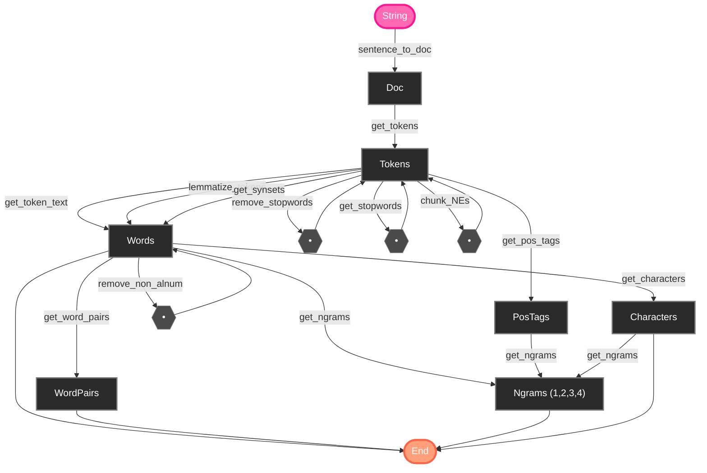

```mermaid
flowchart TD
    %% Styling
    classDef default fill:#2A2A2A,stroke:#7A7A7A,stroke-width:2px,color:white
    classDef start fill:#FF69B4,stroke:#FF1493,stroke-width:3px,color:white
    classDef final fill:#FFA07A,stroke:#FF6347,stroke-width:3px,color:white
    classDef waypoint fill:#4A4A4A,stroke:#7A7A7A,stroke-width:1px,color:white

    %% Nodes
    Start([String]):::start
    A[Doc]:::default
    B[Tokens]:::default
    C[Words]:::default
    F[PosTags]:::default
    K[WordPairs]:::default
    L["Ngrams (1,2,3,4)"]:::default
    M[Characters]:::default
    End([End]):::final
    
    %% Waypoints with diamond shape
    W1{{"•"}}:::waypoint
    W2{{"•"}}:::waypoint
    W3{{"•"}}:::waypoint
    W4{{"•"}}:::waypoint

    %% Main flow
    Start -->|sentence_to_doc| A
    A -->|get_tokens| B
    
    %% Lexical features
    B -->|get_token_text| C
    C -->|get_characters| M
    C -->|get_word_pairs| K
    C -->|remove_non_alnum| W4
    W4 --> C

    %% Preprocessing
    B -->|remove_stopwords| W1
    W1 --> B
    B -->|get_stopwords| W2
    W2 --> B

    %% Semantic features
    B -->|get_pos_tags| F
    B -->|lemmatize_tokens| C
    B -->|get_synsets| C
    B -->|chunk_NEs| W3
    W3 --> B

    %% N-grams and endings
    C -->|get_ngrams| L
    F -->|get_ngrams| L
    M -->|get_ngrams| L
    
    C --> End
    K --> End
    L --> End
    M --> End
```
