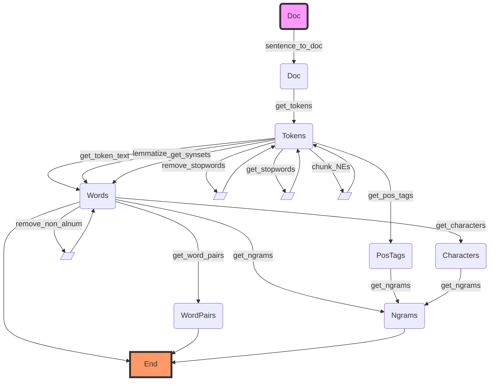

```mermaid
flowchart TD
    style Start fill:#f9f,stroke:#333,stroke-width:4px
    style End fill:#f96,stroke:#333,stroke-width:4px

    Start(Doc) -->|sentence_to_doc| A(Doc)
    A -->|get_tokens| B(Tokens)
    B -->|get_token_text| C(Words)
    B --> |remove_stopwords| B1[/" "/]
    B1 --> B
    B --> |get_stopwords| B2[/"  "/]
    B2 --> B
    B -->|get_pos_tags| F(PosTags)
    B -->|lemmatize_tokens| C
    B -->|get_synsets| C
    B --> |chunk_NEs| B3[/" "/]
    B3 --> B
    C --> |remove_non_alnum| C1[/" "/]
    C1 --> C
    C -->|get_word_pairs| K(WordPairs)
    C -->|get_ngrams| L(Ngrams)
    C -->|get_characters| M(Characters)
    F -->|get_ngrams| L
    C --> End
    K --> End
    L --> End
    M -->|get_ngrams| L
```
